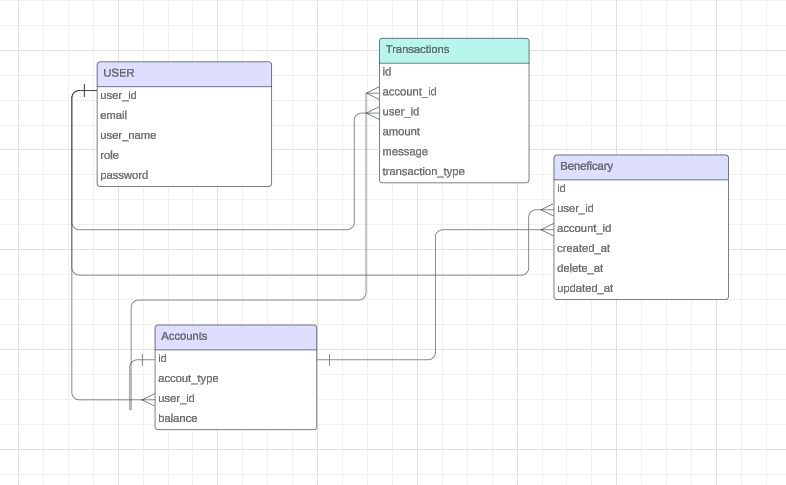

# Project Configurations

## Schema Diagram



## Prerequisites

- Node.js version: 18
- Nest.js CLI version: 10.3.0

## Installation

1. **Clone the repository:**

   ```bash
   git clone https://github.com/ZeeshanZamurd/gensist_fintect.git
   cd your-repo
2.   npm ci
3. env : env.dist is available please use it to create env file by providing required credentials
4. databse: before you run nest start --watch command make it sure database with name fintech specified in postgres
5. nest start --watch: use this command to to run project
6. run test : npm run test (unit test are available for user module)
7. import postman collection to your postman available in project repo
8. you are good to go
